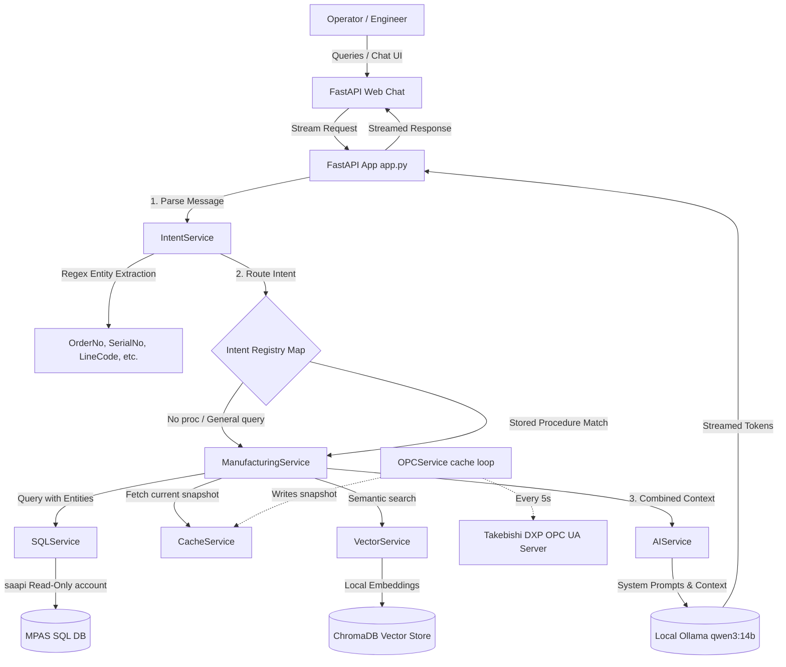

# ⬡ Manufacturing Copilot

Manufacturing Copilot is a secure, decoupled, and highly performant AI assistant designed for the **PNRMPAS** manufacturing plant. It enables operators, engineers, and production leads to query active orders, trace quality metrics, check live OPC tags, review SOPs, and inspect machine statuses in real-time through an intuitive, chat-based interface.

The application is built on a **zero-trust database access model**: the Large Language Model (LLM) never directly writes to, reads from, or generates queries for the database. Instead, a deterministic intent-routing engine maps natural language queries to pre-approved read-only SQL stored procedures, in-memory OPC tag caches, and local semantic search vector stores.

---

## 📡 Core Features

*   **Secure Database Isolation**: The LLM operates strictly on retrieved text contexts. Database access is handled via a dedicated read-only service account (`saapi`) executing pre-approved stored procedures.
*   **Deterministic Intent Routing**: Natural language is parsed algorithmically to extract entities (`OrderNo`, `SerialNo`, `LineCode`, `ShiftID`, etc.) and map them to appropriate data channels, requesting clarification if required entities are missing.
*   **OPC UA Live Cache (Takebishi DXP)**: A background loop polls live machine tags and caches them in memory. Operators get sub-millisecond status updates without putting direct query loads on live production PLCs.
*   **RAG Knowledge Base**: Standard Operating Procedures (SOPs), manuals, and troubleshooting guides are indexed locally in a ChromaDB vector store, enabling semantic query search with inline citations.
*   **Local air-gapped Deployment**: Designed to run entirely on-premise using Ollama (`qwen3:14b` or custom models) and local sentence-transformers, ensuring no sensitive production metrics ever leave the plant network.
*   **Administrative Control Room**: A secure web panel to toggle services at runtime, inspect live OPC cache tables, register or describe stored procedures, upload knowledge base files, and test connection states.

---

## 🏗️ System Architecture

The following diagram illustrates the decoupled request-response flow:



An official diagram is available in [Architecture.png](Architecture.png).

---

## 🗂️ Project Structure

```
├── app.py                     # FastAPI application routes & server startup
├── requirements.txt           # Python dependency file
├── config/
│   └── settings.py            # Pydantic Settings configuration validator
├── services/
│   ├── ai_service.py          # Chat stream client for local Ollama / Qwen3
│   ├── cache_service.py       # Thread-safe, in-memory OPC UA tag cache
│   ├── intent_service.py      # Entity extraction & intent routing engine
│   ├── manufacturing_service.py # Core business logic orchestrator
│   ├── opc_service.py         # Asynchronous Takebishi DXP client & simulation loop
│   ├── sql_service.py         # Stored procedure executor & parameter mapper
│   └── vector_service.py      # ChromaDB document indexer and search client
├── templates/
│   ├── index.html             # High-tech dark-themed chat dashboard
│   └── admin.html             # Light-themed grid administration control panel
├── static/
│   └── css/
│       ├── index.css          # Dark HUD interface styles
│       └── admin.css          # Admin grid and control system styles
├── prompts/
│   └── system_prompt.txt      # Formatting rules & identity guidelines for the AI
├── docs/
│   └── architecture_details.md # In-depth technical documentation
└── Screenshots/               # Project screenshots for demonstration
```

---

## 🛠️ Getting Started

### Prerequisites

*   Python 3.11+
*   SQL Server with `MPAS_DB` installed (or local development instance)
*   Takebishi DXP OPC UA Server (or simulation mode will run automatically)
*   Ollama installed locally

### Setup Instructions

1.  **Clone the Repository**:
    ```bash
    git clone https://github.com/NithinBkurup/manufacturing-copilot.git
    cd manufacturing-copilot
    ```

2.  **Create a Virtual Environment**:
    ```bash
    python -m venv .venv
    # Windows
    .venv\Scripts\activate
    # macOS/Linux
    source .venv/bin/activate
    ```

3.  **Install Dependencies**:
    ```bash
    pip install -r requirements.txt
    ```

4.  **Configure Environment Variables**:
    Create a `.env` file in the root directory (based on the settings in `config/settings.py`):
    ```env
    # App Settings
    APP_PORT=3020
    DEBUG=False

    # Plant Configuration
    PLANT_NAME=PNRMPAS
    PLANT_CODE=2006
    SERVER_NAME=ManufacturingCopilot

    # Database Configuration
    SQL_SERVER=your-sql-server
    SQL_DATABASE=MPAS_DB
    SQL_USERNAME=saapi
    SQL_PASSWORD=your-saapi-password
    SQL_DRIVER=ODBC Driver 17 for SQL Server

    # OPC UA Configuration
    OPC_SERVER_URL=opc.tcp://localhost:49320
    OPC_NAMESPACE=2
    OPC_CACHE_INTERVAL_SEC=5

    # LLM Settings
    OLLAMA_BASE_URL=http://localhost:11434
    OLLAMA_MODEL=qwen3:14b
    ```

5.  **Initialize Ollama**:
    Download and run the target model in Ollama:
    ```bash
    ollama pull qwen3:14b
    ```

6.  **Run the Copilot**:
    ```bash
    python app.py
    ```
    Open `http://localhost:3020` in your web browser.

7.  **Enable Services**:
    Upon startup, all services are disabled by default. Head to the **Admin Panel** (`http://localhost:3020/admin`) to test connections and activate the **AI Model**, **SQL Database**, **OPC UA Server**, and **Knowledge Base** instances.
